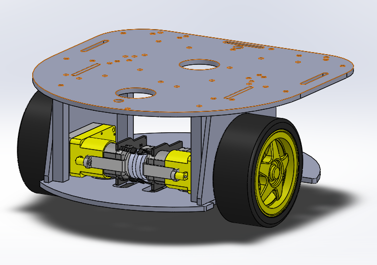

# mikrik-robot-cad
CAD-files to assembly mikrik robot by yourself using laser cutter and 3D-printer.
Please follow my guide on Hackster to build MIKRIK robot.

## Parts fro laser cutting (3mm sheet ABS plastic)

- Bottom_Plate_1.STL
- LattePanda_Delta_3_Plate.STL
- Motor_Side_1.STL
- Raspberry_Pi_4_Plate.STL
- Top_Plate_1.STL

## Parts for 3D-printing (PLA or ABS)

- 55mm_Standoff.STL
- 8mm_Standoff.STL

## Project image

